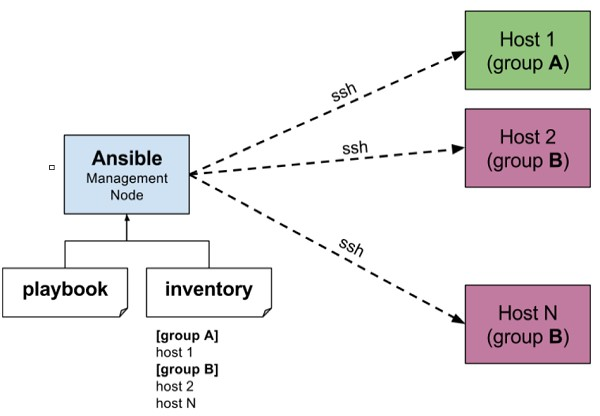

## Introduction: 

• Ansible is simple open source IT engine which automates application deployment, intra service orchestration, cloud provisioning and many other IT tools. Ansible is easy to deploy because it does not use any agents or custom security infrastructure. 
	
• Ansible uses playbook to describe automation jobs, and playbook uses very simple language i.e. YAML (It’s a human-readable data serialization language & is commonly used for configuration files, but could be used in many applications where data is being stored)which is very easy for humans to understand, read and write. Hence the advantage is that even the IT infrastructure support guys can read and understand the playbook and debug if needed (YAML – It is in human readable form). 

• Ansible is designed for multi-tier deployment. Ansible does not manage one system at time, it models IT infrastructure by describing all of your systems are interrelated. Ansible is completely agentless which means Ansible works by connecting your nodes through ssh(by default). But if you want other method for connection like Kerberos, Ansible gives that option to you. 

• After connecting to your nodes, Ansible pushes small programs called as “Ansible Modules”. Ansible runs that modules on your nodes and removes them when finished. Ansible manages your inventory in simple text files (These are the hosts file). Ansible uses the hosts file where one can group the hosts and can control the actions on a specific group in the playbooks.             

 

Sample Hosts File 

This is the content of hosts file −      
~~~
#File name: hosts
#Description: Inventory file for your application. Defines machine type abc
node to deploy specific artifacts
~~~ 

# Defines machine type def node to upload metadata. 
~~~
[abc-node]
#server1 ansible_host = <target machine for DU deployment> ansible_user = <Ansible
user> ansible_connection = ssh
server1 ansible_host = <your host name> ansible_user = <your unix user>
ansible_connection = ssh
[def-node]
#server2 ansible_host = <target machine for artifact upload>
ansible_user = <Ansible user> ansible_connection = ssh
server2 ansible_host = <host> ansible_user = <user> ansible_connection = ssh 
~~~

# 3 Node Set-Up 
~~~~
Step 1: Install Python on RHEL 8 / CentOS 8

	• sudo dnf -y install python3-pip  
	
	• sudo pip3 install --upgrade pip
For Python2 users you have to install python2-pip
	• sudo dnf -y install python2-pip  
	
	• sudo pip2 install --upgrade pip 
~~~~ 

Step 2: Install Ansible on RHEL 8 / CentOS 8 

There are two methods from which you can install Ansible on CentOS 8 / RHEL 8.

Method 1: Install Ansible on CentOS 8 / RHEL 8 from EPEL 

Add EPEL repository to your CentOS 8 / RHEL 8 system. 
~~~~
	• sudo dnf -y install https://dl.fedoraproject.org/pub/epel/epel-release-latest-8.noarch.rpm 
~~~~	
Then Enable EPEL playground repository and install Ansible on CentOS 8 / RHEL 8 from it. 
~~~~
	• sudo dnf install  --enablerepo epel-playground  ansible 
~~~~ 
~~~~
This will default to using Python 3, so some Python 3 packages are installed.
Dependencies resolved.
===================================================================================================================================================
 Package                            Arch                     Version                                       Repository                         Size
===================================================================================================================================================
Installing:
 ansible                            noarch                   2.8.5-2.epel8.playground                      epel-playground                    15 M
Installing dependencies:
 python3-jmespath                   noarch                   0.9.0-11.el8                                  AppStream                          45 k
 python3-pyasn1                     noarch                   0.3.7-6.el8                                   AppStream                         126 k
 python3-bcrypt                     x86_64                   3.1.6-2.epel8.playground.1                    epel-playground                    44 k
 python3-pynacl                     x86_64                   1.3.0-5.epel8.playground                      epel-playground                   100 k
 sshpass                            x86_64                   1.06-9.epel8.playground                       epel-playground                    27 k
 libsodium                          x86_64                   1.0.18-2.el8                                  epel                              162 k
Installing weak dependencies:
 python3-paramiko                   noarch                   2.4.3-1.epel8.playground                      epel-playground                   289 k
Transaction Summary
===================================================================================================================================================
Install  8 Packages
Total download size: 15 M
Installed size: 81 M
Is this ok [y/N]: y 
~~~~ 

Check the version of Ansible installed on your CentOS 8 / RHEL 8 system. 

~~~~
• $ ansible --version 
~~~~
~~~~
ansible 2.8.5
  config file = /etc/ansible/ansible.cfg
  configured module search path = ['/home/cloud-user/.ansible/plugins/modules', '/usr/share/ansible/plugins/modules']
  ansible python module location = /usr/lib/python3.6/site-packages/ansible
  executable location = /usr/bin/ansible
  python version = 3.6.8 (default, Jul  1 2019, 16:43:04) [GCC 8.2.1 20180905 (Red Hat 8.2.1-3)]
~~~~ 

Method 2: Install Ansible on CentOS 8 / RHEL 8 using pip 

Once you have Pip installed, you can use it to get Ansible installed in your CentOS 8 / RHEL 8 machine.
~~~~
$ pip3 install ansible --user
~~~~
For Python2 pip, use: 
~~~~
$ pip2 install ansible --user
~~~~
You can see Ansible installed using the following command: 
~~~~
$ ansible --version
ansible 2.7.5
config file = None
configured module search path = ['/home/jmutai/.ansible/plugins/modules', '/usr/share/ansible/plugins/modules']
ansible python module location = /home/jmutai/.local/lib/python3.6/site-packages/ansible
executable location = /home/jmutai/.local/bin/ansible
python version = 3.6.6 (default, Oct 16 2018, 01:53:53) [GCC 8.2.1 20180905 (Red Hat 8.2.1-3)] 
~~~~

Step 3: Testing Ansible on CentOS 8 / RHEL 8 Linux  

~~~~
To test Ansible, you should have OpenSSH service running on the remote server.
$ sudo systemctl status sshd
● sshd.service - OpenSSH server daemon
Loaded: loaded (/usr/lib/systemd/system/sshd.service; enabled; vendor preset: enabled)
Active: active (running) since Sat 2018-12-29 20:17:11 EAT; 39min ago
Docs: man:sshd(8)
man:sshd_config(5)
Main PID: 820 (sshd)
Tasks: 1 (limit: 11510)
Memory: 4.6M
CGroup: /system.slice/sshd.service
└─820 /usr/sbin/sshd -D -oCiphers=aes256-gcm@openssh.com,chacha20-poly1305@openssh.com,aes256-ctr,aes256-cbc,aes128-gcm@openssh.com,aes128->
Dec 29 20:17:11 rhel8.local systemd[1]: Starting OpenSSH server daemon…
Dec 29 20:17:11 rhel8.local sshd[820]: Server listening on 0.0.0.0 port 22.
Dec 29 20:17:11 rhel8.local sshd[820]: Server listening on :: port 22.
Dec 29 20:17:11 rhel8.local systemd[1]: Started OpenSSH server daemon.
Dec 29 20:19:03 rhel8.local sshd[1499]: Accepted publickey for jmutai from 192.168.122.1 port 35902 ssh2: RSA SHA256:b/8AoYgbThoBYPcFh7CetJuGY/Tl7s4fi>
Dec 29 20:19:03 rhel8.local sshd[1499]: pam_unix(sshd:session): session opened for user jmutai by (uid=0)
~~~~ 

# Create Ansible inventory file, default is /etc/ansible/hosts 

I like creating inventory file in my working directory. 
~~~~
$ vim hosts
Copy the IP address of your remote server(s) to manage and add to Ansible inventory file.
$ echo "192.168.122.197" > hosts
You can also create a group of hosts like below: 
~~~~
~~~~
[web]
192.168.122.197

[db]
192.168.122.198

[staging]
192.168.122.199
192.168.122.200
192.168.122.201 
~~~~ 

Generate SSH key and copy it to remote servers. 

~~~~
$ ssh-keygen
$ ssh-copy-id  jmutai@192.168.122.197
Use ping module to test ansible:
$ ansible  -i hosts  192.168.122.197 -m ping  
192.168.122.197 | SUCCESS => {
"changed": false,
"ping": "pong"
}
The -i option is used to provide path to inventory file. You should get the same output for hosts group name.
$ ansible  -i hosts  web -m ping  
192.168.122.197 | SUCCESS => {
"changed": false,
"ping": "pong"
}
For commands that need sudo, pass the option --ask-become-pass. This will ask for privilege escalation password. This may require installation of the sshpass program.
$ ansible  -i hosts  web -m command -a "sudo yum install vim"  --ask-become-pass
....
192.168.122.197 | CHANGED | rc=0 >>
 Updating Subscription Management repositories.
 Updating Subscription Management repositories.
 Last metadata expiration check: 0:52:23 ago on Sat 29 Dec 2018 08:28:46 PM EAT.
 Package vim-enhanced-2:8.0.1763-7.el8.x86_64 is already installed.
 Dependencies resolved.
 Nothing to do.
 Complete! 
~~~~

What is Configuration Management      

• Configuration management in terms of Ansible means that it maintains configuration of the product performance by keeping a record and updating detailed information which describes an enterprise’s hardware and software.  

• Such information typically includes the exact versions and updates that have been applied to installed software packages and the locations and network addresses of hardware devices. For e.g. If you want to install the new version of WebLogic/WebSphere server on all of the machines present in your enterprise, it is not feasible for you to manually go and update each and every machine.  

• You can install WebLogic/WebSphere in one go on all of your machines with Ansible playbooks and inventory written in the most simple way. All you have to do is list out the IP addresses of your nodes in the inventory and write a playbook to install WebLogic/WebSphere. Run the playbook from your control machine & it will be installed on all your nodes.                     

How Ansible Works?              

The picture given below shows the working of Ansible.
Ansible works by connecting to your nodes and pushing out small programs, called "Ansible modules" to them. Ansible then executes these modules (over SSH by default), and removes them when finished. Your library of modules can reside on any machine, and there are no servers, daemons, or databases required.   
	
	

• The management node in the above picture is the controlling node (managing node) which controls the entire execution of the playbook. It’s the node from which you are running the installation. The inventory file provides the list of hosts where the Ansible modules needs to be run and the management node does a SSH connection and executes the small modules on the hosts machine and installs the product/software.  

• Beauty of Ansible is that it removes the modules once those are installed so effectively it connects to host machine , executes the instructions and if it’s successfully installed removes the code which was copied on the host machine which was executed.

Variables 

Just like any other Scripting or programming language we can use variable in ansible playbooks. Variables could store different values for different items. Variables help us to have shorter and more readable playbooks. Imagine we want to apply patches on hundreds of servers, the only thing we need is single playbook with some variables for all hundred servers! It's the variables that store information about different IP addresses, host names, username or passwords,... 

Naming Variables 
~~~~
Variable names must start with a letter, and they can only contain letters, numbers, and underscores. The following table illustrates the difference between invalid and valid variable names.
INVALID VARIABLE NAMES
VALID VARIABLE NAMES
web server
web_server
remote.file
remote_file
1st file
file_1, file1
remoteserver$1
remote_server_1, remote_server1 
~~~~ 

Inventory 

Default: 

~~~~
/etc/ansible/hosts:

[root@control1 ~]# cat /etc/ansible/hosts
# This is the default ansible 'hosts' file.
#
# It should live in /etc/ansible/hosts
#
#   - Comments begin with the '#' character
#   - Blank lines are ignored
#   - Groups of hosts are delimited by [header] elements
#   - You can enter hostnames or ip addresses
#   - A hostname/ip can be a member of multiple groups

# Ex 1: Ungrouped hosts, specify before any group headers.

## green.example.com
## blue.example.com
## 192.168.100.1
## 192.168.100.10

# Ex 2: A collection of hosts belonging to the 'webservers' group

## [webservers]
## alpha.example.org
## beta.example.org
## 192.168.1.100
## 192.168.1.110

# If you have multiple hosts following a pattern you can specify
# them like this:

## www[001:006].example.com

# Ex 3: A collection of database servers in the 'dbservers' group

## [dbservers]
##
## db01.intranet.mydomain.net
## db02.intranet.mydomain.net
## 10.25.1.56
## 10.25.1.57

# Here's another example of host ranges, this time there are no
# leading 0s:

## db-[99:101]-node.example.com

~~~~

Inventory File samples 

~~~~
#Sample Inventory File
server1.company.com
192.168.10.2

#Grouping servers
server1.company.com
192.16.10.2

[mail]
192.168.10.3
server4.company.com

[db]
server5.company.com
server6.company.com
~~~~

## Using alias ## 

~~~~ 

web1 ansible_host=server1.company.com

db1 ansible_host=server2.company.com

mail1 ansible_host=192.168.10.3

web2 ansible_host=server4.company.com 

~~~~

Create Inventory 

~~~~ 
[user1@controller ~]$ mkdir demo-inventory
[user1@controller ~]$ cd demo-inventory/
[user1@controller demo-inventory]$ ll
total 0
[user1@controller demo-inventory]$ vim inventory.txt
[user1@controller demo-inventory]$ cat inventory.txt
ubuntu  
~~~~ 

The list of machines in the inventory can be found out through the ansible --list-hosts all command :

~~~~
[user1@controller demo-inventory]$ ansible --list-hosts all -i inventory.txt
  hosts (1):
    ubuntu

We can specify a different inventory file at the command line using the -i <path> option.
 And now, First Ansible Task! You can ping all of your inventory machines using the following command:

[user1@controller demo-inventory]$  ansible ubuntu -m ping -i inventory.txt
ubuntu | SUCCESS => {
    "ansible_facts": {
        "discovered_interpreter_python": "/usr/bin/python3"
    },
    "changed": false,
    "ping": "pong"
}

so that confirms that our ansible controller can successfully communicate or connect to the target machines. lets update inventory.txt file by adding second target: 

[user1@controller demo-inventory]$ cat inventory.txt
ubuntu 
centos 

and lets  see the results: 

[user1@controller demo-inventory]$ ansible all  -m ping -i inventory.txt
centos | SUCCESS => {
    "ansible_facts": {
        "discovered_interpreter_python": "/usr/bin/python"
    },
    "changed": false,
    "ping": "pong"
}
ubuntu | SUCCESS => {
    "ansible_facts": {
        "discovered_interpreter_python": "/usr/bin/python3"
    },
    "changed": false,
    "ping": "pong"
}
~~~~ 
	
There is a group that Ansible creates by default and that's called theall group. The all group is a built-in group that Ansible creates and it has all the servers in our inventory file part of that group.
If there is a problem with python on one of your target nodes, you can send a raw module (we will talk about it later):
~~~~
[user1@controller demo-inventory]$ ansible -m raw -a "/usr/bin/uptime" -i inventory.txt all
centos | CHANGED | rc=0 >>
 10:12:35 up 23:33,  2 users,  load average: 0.00, 0.01, 0.05
Shared connection to centos closed.

ubuntu | CHANGED | rc=0 >>
 22:42:35 up 19:20,  2 users,  load average: 0.00, 0.00, 0.00
Shared connection to ubuntu closed.

And if you like to see which python version has been installed on remote machines use shell module(we will talk about it later): 

[user1@controller demo-inventory]$ ansible -m shell -a "python -V" -i inventory.txt all
centos | CHANGED | rc=0 >>
Python 2.7.5
[DEPRECATION WARNING]: Distribution Ubuntu 18.04 on host ubuntu should use
/usr/bin/python3, but is using /usr/bin/python for backward compatibility with
prior Ansible releases. A future Ansible release will default to using the
discovered platform python for this host. See https://docs.ansible.com/ansible/
2.9/reference_appendices/interpreter_discovery.html for more information. This
feature will be removed in version 2.12. Deprecation warnings can be disabled
by setting deprecation_warnings=False in ansible.cfg.
ubuntu | CHANGED | rc=0 >>
Python 2.7.17

Deprecation warnings can be disabled by setting deprecation_warnings=False in ansible.cfg
~~~~ 
	
Now that you know about inventory files let put our targets nodes information on /etc/ansible/hosts :
~~~~
[root@controller ~]# tail -n7 /etc/ansible/hosts

ubuntu
centos

[lab]
ubuntu
centos

~~~~

# Ansible Adhoc Commands  

Ran ansible playbook 

~~~~ 
ansible-playbook -i /home/ansible/inventory /home/ansible/web.yml   
~~~~
~~~~
ansible-playbook -i <play_book_name>.yml     
~~~~

Running the Playbook 
~~~~
ansible-playbook user.yml --extra-vars "target = "<your host variable>"
~~~~ 
	
If {{ target }} isn't defined, the playbook does nothing. A group from the hosts file can also be passed through if need be. This does not harm if the extra vars is not provided. 

Playbook targeting a single host 

$ ansible-playbook user.yml --extra-vars "target = <your hosts variable>" --listhosts 	

	

Syntax Check 
	
~~~~ 
• ansible-playbook  <play_book_name>.yml  --syntax-check
~~~~ 
	
Testing Connection to Ansible Hosts 
	
~~~~  
	
The following command will test connectivity between your Ansible control node and all your Ansible hosts. This command uses the current system user and its corresponding SSH key as the remote login, and includes the -m option, which tells Ansible to run the ping module. It also features the -i flag, which tells Ansible to ping the hosts listed in the specified inventory file
~~~~
ansible all-i inventory-m ping
~~~~ 

If this is the first time you’re connecting to these servers via SSH, you’ll be asked to confirm the authenticity of the hosts you’re connecting to via Ansible. When prompted, type yes and then hit ENTER to confirm.
You should get output similar to this:

Output
server1 | SUCCESS => {
    "changed": false, 
    "ping": "pong"
}
server2 | SUCCESS => {
    "changed": false, 
    "ping": "pong"
}
Once you get a "pong" reply back from a host, it means the connection is live and you’re ready to run Ansible commands on that server.
Adjusting Connection Options
By default, Ansible tries to connect to the nodes as a remote user with the same name as your current system user, using its corresponding SSH keypair.
To connect as a different remote user, append the command with the -u flag and the name of the intended user:
~~~~
ansible all -i inventory -m ping-u sammy
~~~~ 

If you’re using a custom SSH key to connect to the remote servers, you can provide it at execution time with the --private-key option: 
	
~~~~
ansible all -i inventory -m ping--private-key=~/.ssh/custom_id
~~~~ 
Once you’re able to connect using the appropriate options, you can adjust your inventory file to automatically set your remote user and private key, in case they are different from the default values assigned by Ansible. Then, you won’t need to provide those parameters in the command line.
The following example inventory file sets up the ansible_user variable only for the server1 server:
~/ansible/inventory 
~~~~
server1 ansible_host=203.0.113.111 ansible_user=sammyserver2 ansible_host=203.0.113.112
~~~~ 

Ansible will now use sammy as the default remote user when connecting to the server1 server.
To set up a custom SSH key, include the ansible_ssh_private_key_file variable as follows:
~/ansible/inventory 
~~~~
server1 ansible_host=203.0.113.111 ansible_ssh_private_key_file=/home/sammy/.ssh/custom_idserver2 ansible_host=203.0.113.112
~~~~ 

In both cases, we have set up custom values only for server1. If you want to use the same settings for multiple servers, you can use a child group for that:
~/ansible/inventory 
~~~~
[group_a]203.0.113.111
203.0.113.112
[group_b]203.0.113.113
[group_a:vars]ansible_user=sammyansible_ssh_private_key_file=/home/sammy/.ssh/custom_id
~~~~ 

This example configuration will assign a custom user and SSH key only for connecting to the servers listed in group_a.

~~~~

Defining targets for command execution	 
	

	
When running ad hoc commands with Ansible, you can target individual hosts, as well as any combination of groups, hosts and subgroups. For instance, this is how you would check connectivity for every host in a group named servers:

~~~~~ 
• ansible servers-i inventory -m ping 
~~~~~ 
 

You can also specify multiple hosts and groups by separating them with colons:
~~~~~
• ansible server1:server2:dbservers-i inventory -m ping
~~~~~ 

To include an exception in a pattern, use an exclamation mark, prefixed by the escape character \, as follows. This command will run on all servers from group1, except server2:
~~~~~
• ansible group1:\!server2-i inventory -m ping
~~~~~ 

In case you’d like to run a command only on servers that are part of both group1 and group2, for instance, you should use & instead. Don’t forget to prefix it with a \ escape character:
~~~~~
• ansible group1:\&group2-i inventory -m ping 
~~~~~

~~~~~	
To ping all connections: 

[user1@controller demo-playbook]$  ansible all -m ping
centos | SUCCESS => {
    "ansible_facts": {
        "discovered_interpreter_python": "/usr/bin/python"
    },
    "changed": false,
    "ping": "pong"
}
ubuntu | SUCCESS => {
    "ansible_facts": {
        "discovered_interpreter_python": "/usr/bin/python3"
    },
    "changed": false,
    "ping": "pong"
}
~~~~~
	
Running Ansible Modules 

Ansible modules are pieces of code that can be invoked from playbooks and also from the command-line to facilitate executing procedures on remote nodes. Examples include the apt module, used to manage system packages on Ubuntu, and the user module, used to manage system users. The ping command used throughout this guide is also a module, typically used to test connection from the control node to the hosts.Ansible ships with an extensive collection of built-in modules, some of which require the installation of additional software in order to provide full functionality. You can also create your own custom modules using your language of choice.
	
~~~~  
	

To execute a module with arguments, include the -a flag followed by the appropriate options in double quotes, like this:
~~~~
ansible target-i inventory -m module-a "module options" 
~~~~
As an example, this will use the apt module to install the package tree on server1:
~~~~
ansible server1-i inventory -m apt-a "name=tree"
~~~~
~~~~ 

Running Bash Commands 

	
When a module is not provided via the -m option, the command module is used by default to execute the specified command on the remote server(s).
This allows you to execute virtually any command that you could normally execute via an SSH terminal, as long as the connecting user has sufficient permissions and there aren’t any interactive prompts.
This example executes the uptime command on all servers from the specified inventory: 
	
~~~~  
ansible all-i inventory -a "uptime"
~~~~
~~~~
Copy

Output
server1| CHANGED | rc=0 >>
 14:12:18 up 55 days,  2:15,  1 user,  load average: 0.03, 0.01, 0.00
server2| CHANGED | rc=0 >>
 14:12:19 up 10 days,  6:38,  1 user,  load average: 0.01, 0.02, 0.00	
~~~~ 

# Using Privilege Escalation to Run Commands with sudo 
	
If the command or module you want to execute on remote hosts requires extended system privileges or a different system user, you’ll need to use Ansible’s privilege escalation module, become.  
	
This module is an abstraction for sudo as well as other privilege escalation software supported by Ansible on different operating systems. 
	
For instance, if you wanted to run a tail command to output the latest log messages from Nginx’s error log on a server named server1 from inventory, you would need to include the --become option as follows:

~~~~
ansible server1-i inventory -a "tail /var/log/nginx/error.log"--become
~~~~ 

This would be the equivalent of running a sudo tail /var/log/nginx/error.log command on the remote host, using the current local system user or the remote user set up within your inventory file. 
	
Privilege escalation systems such as sudo often require that you confirm your credentials by prompting you to provide your user’s password. That would cause Ansible to fail a command or playbook execution. You can then use the --ask-become-pass or -K option to make Ansible prompt you for that sudo password:

~~~~
ansible server1-i inventory -a "tail /var/log/nginx/error.log"--become -K
~~~~

Installing & Removing Packages: 

The following example uses the apt module to install the nginx package on all nodes from the provided inventory file:

~~~~
ansible all -i inventory -m apt-a "name=nginx"--become -K
~~~~ 

To remove a package, include the state argument and set it to absent: 
	
~~~~
ansible all -i inventory -m apt-a "name=nginxstate=absent"--become  -K
~~~~

# File Transfer 

With the file module, you can copy files between the control node and the managed nodes, in either direction. The following command copies a local text file to all remote hosts in the specified inventory file:

~~~~
ansible all -i inventory -m copy-a "src=./file.txtdest=~/myfile.txt" 
~~~~
 

To copy a file from the remote server to your control node, include the remote_src option:

~~~~
ansible all -i inventory -m copy-a "src=~/myfile.txtremote_src=yesdest=./file.txt"  
~~~~

Create new directory: 

~~~~
$ Ansible abc -m file -a "dest = /path/user1/new mode = 777 owner = user1 group = user1 state = directory" 
~~~~ 

Delete whole directory and files: 

~~~~
$ Ansible abc -m file -a "dest = /path/user1/new state = absent"
~~~~  

Managing Packages 

The Ad-hoc commands are available for yum and apt. Following are some Ad-hoc commands using yum.
The following command checks if yum package is installed or not, but does not update it. 
	
~~~~ 	
Ansible abc -m yum -a "name = demo-tomcat-1 state = present"  
~~~~	

The following command check the package is not installed. 
	
~~~~	
$ Ansible abc -m yum -a "name = demo-tomcat-1 state = absent"   
~~~~	 
	
The following command checks the latest version of package is installed. 
	
~~~~	
$ Ansible abc -m yum -a "name = demo-tomcat-1 state = latest" 
~~~~

Gathering facts 
	
Facts can be used for implementing conditional statements in playbook. You can find adhoc information of all your facts through the following Ad-hoc command −
~~~~
$ Ansible all -m setup 
~~~~

Changing File Permissions 

To modify permissions on files and directories on your remote nodes, you can use the file module.
The following command will adjust permissions on a file named file.txt located at /var/www on the remote host. It will set the file’s umask to 600, which will enable read and write permissions only for the current file owner. Additionally, it will set the ownership of that file to a user and a group called sammy:

~~~~
ansible all -i inventory -m file-a "dest=/var/www/file.txtmode=600owner=sammygroup=sammy"--become  -K
~~~~ 

Because the file is located in a directory typically owned by root, we might need sudo permissions to modify its properties. That’s why we include the --become and -K options. These will use Ansible’s privilege escalation system to run the command with extended privileges, and it will prompt you to provide the sudo password for the remote user.

Restarting Services 

You can use the service module to manage services running on the remote nodes managed by Ansible. This will require extended system privileges, so make sure your remote user has sudo permissions and you include the --become option to use Ansible’s privilege escalation system. Using -K will prompt you to provide the sudo password for the connecting user.!
 

To restart the nginx service on all hosts in group called webservers, for instance, you would run:
~~~~
ansible webservers-i inventory -m service-a "name=nginxstate=restarted"--become  -K!
~~~~

	
Restarting Servers 

Although Ansible doesn’t have a dedicated module to restart servers, you can issue a bash command that calls the /sbin/reboot command on the remote host.
Restarting the server will require extended system privileges, so make sure your remote user has sudo permissions and you include the --become option to use Ansible’s privilege escalation system. Using -K will prompt you to provide the sudo password for the connecting user.
Warning: The following command will fully restart the server(s) targeted by Ansible. That might cause temporary disruption to any applications that rely on those servers.
To restart all servers in a webservers group, for instance, you would run:

~~~~
ansible webservers-i inventory -a "/sbin/reboot"--become  -K
~~~~ 

By default, Ansible will run the above Ad-hoc commands form current user account. If you want to change this behavior, you will have to pass the username in Ad-hoc commands as follows − 
	
~~~~ 
$ Ansible abc -a "/sbin/reboot" -f 12 -u username 
~~~~  
	
Gathering Information about remote Nodes: 

The setup module returns detailed information about the remote systems managed by Ansible, also known as system facts.
To obtain the system facts for server1, run: 
	
~~~~
ansible server1-i inventory -m setup
~~~~ 

This will print a large amount of JSON data containing details about the remote server environment. To print only the most relevant information, include the "gather_subset=min" argument as follows: 
	
~~~~
ansible server1-i inventory -m setup-a "gather_subset=min"
~~~~ 

To print only specific items of the JSON, you can use the filter argument. This will accept a wildcard pattern used to match strings, similar to fnmatch. For example, to obtain information about both the ipv4 and ipv6 network interfaces, you can use *ipv* as filter: 
	
~~~~
ansible server1-i inventory -m setup-a "filter=*ipv*"
~~~~ 

~~~~
Output
server1 | SUCCESS => {
    "ansible_facts": {
        "ansible_all_ipv4_addresses": [
            "203.0.113.111", 
            "10.0.0.1"
        ], 
        "ansible_all_ipv6_addresses": [
            "fe80::a4f5:16ff:fe75:e758"
        ], 
        "ansible_default_ipv4": {
            "address": "203.0.113.111", 
            "alias": "eth0", 
            "broadcast": "203.0.113.111", 
            "gateway": "203.0.113.1", 
            "interface": "eth0", 
            "macaddress": "a6:f5:16:75:e7:58", 
            "mtu": 1500, 
            "netmask": "255.255.240.0", 
            "network": "203.0.113.0", 
            "type": "ether"
        }, 
        "ansible_default_ipv6": {}
    }, 
    "changed": false
}
If you’d like to check disk usage, you can run a Bash command calling the df utility, as follows:
~~~~

~~~~	
ansible all -i inventory -a "df -h"

Output
server1 | CHANGED | rc=0 >>
Filesystem      Size  Used Avail Use% Mounted on
udev            3.9G     0  3.9G   0% /dev
tmpfs           798M  624K  798M   1% /run
/dev/vda1       155G  2.3G  153G   2% /
tmpfs           3.9G     0  3.9G   0% /dev/shm
tmpfs           5.0M     0  5.0M   0% /run/lock
tmpfs           3.9G     0  3.9G   0% /sys/fs/cgroup
/dev/vda15      105M  3.6M  101M   4% /boot/efi
tmpfs           798M     0  798M   0% /run/user/0
server2 | CHANGED | rc=0 >>
Filesystem      Size  Used Avail Use% Mounted on
udev            2.0G     0  2.0G   0% /dev
tmpfs           395M  608K  394M   1% /run
/dev/vda1        78G  2.2G   76G   3% /
tmpfs           2.0G     0  2.0G   0% /dev/shm
tmpfs           5.0M     0  5.0M   0% /run/lock
tmpfs           2.0G     0  2.0G   0% /sys/fs/cgroup
/dev/vda15      105M  3.6M  101M   4% /boot/efi
tmpfs           395M     0  395M   0% /run/user/0
~~~~  
	
Shutting down servers  
	
~~~~	
[user1@controller demo-adhoc]$ ansible all -b -a "shutdown -r"
centos | CHANGED | rc=0 >>
Shutdown scheduled for Mon 2021-06-28 13:58:27 +0430, use 'shutdown -c' to cancel.
ubuntu | CHANGED | rc=0 >>
Shutdown scheduled for Mon 2021-06-28 02:28:27 PDT, use 'shutdown -c' to cancel.
~~~~

# Playbook Structure 

Playbooks are the files where Ansible code is written. Playbooks are written in YAML format. YAML stands for Yet Another Markup Language. Playbooks are one of the core features of Ansible and tell Ansible what to execute. They are like a to-do list for Ansible that contains a list of tasks.
Playbooks contain the steps which the user wants to execute on a particular machine. Playbooks are run sequentially. Playbooks are the building blocks for all the use cases of Ansible.

Playbook Structure

Each playbook is an aggregation of one or more plays in it. Playbooks are structured using Plays. There can be more than one play inside a playbook.
The function of a play is to map a set of instructions defined against a particular host.
YAML is a strict typed language; so, extra care needs to be taken while writing the YAML files. There are different YAML editors but we will prefer to use a simple editor like notepad++. Just open notepad++ and copy and paste the below yaml and change the language to YAML (Language → YAML).
A YAML starts with --- (3 hyphens)

Create a Playbook
Let us start by writing a sample YAML file. We will walk through each section written in a yaml file.
~~~~
--- 
   name: install and configure DB
   hosts: testServer
   become: yes
 
   vars: 
      oracle_db_port_value : 1521
   
   tasks:
   -name: Install the Oracle DB
      yum: <code to install the DB>
    
   -name: Ensure the installed service is enabled and running
   service:
      name: <your service name>
~~~~

The above is a sample Playbook where we are trying to cover the basic syntax of a playbook. Save the above content in a file as test.yml. A YAML syntax needs to follow the correct indentation and one needs to be a little careful while writing the syntax.

The Different YAML Tags 

Let us now go through the different YAML tags. The different tags are described below −
name
This tag specifies the name of the Ansible playbook. As in what this playbook will be doing. Any logical name can be given to the playbook. 
	
hosts 
	
This tag specifies the lists of hosts or host group against which we want to run the task. The hosts field/tag is mandatory. It tells Ansible on which hosts to run the listed tasks. The tasks can be run on the same machine or on a remote machine. One can run the tasks on multiple machines and hence hosts tag can have a group of hosts’ entry as well.

vars 
	
Vars tag lets you define the variables which you can use in your playbook. Usage is similar to variables in any programming language.

tasks 
	
All playbooks should contain tasks or a list of tasks to be executed. Tasks are a list of actions one needs to perform. A tasks field contains the name of the task. This works as the help text for the user. It is not mandatory but proves useful in debugging the playbook. Each task internally links to a piece of code called a module. A module that should be executed, and arguments that are required for the module you want to execute.

Example 2: Simple Playbook

~~~~
---

  - name: Simple Playbook
    hosts: webservers
    tasks:
      - name: ensure apache is at the latest version
        yum:
          name: httpd
          state: latest
~~~~ 

Example 3: Apache

~~~~  

abcd.yml -> Installs Apache

---
- hosts: all
tasks:
- name: install apchae2 in all 100 servers
apt:
name: apache2
state: present
- name: start apche2 in all 100 servers
service:
name: apache2
state: started

From <https://www.decodingdevops.com/ansible-basics-tutorial-commands/> 

~~~~

Example Play1 
~~~~	
---

#Sample Ansible Playbook1.yml
-
  name: Play1
  hosts: centos
  tasks:
    - name : Execute command 'date'
      command: date
      
    - name : Execute script on server
      script: my_script.sh
      
    - name : Install httpd service
      yum:
        name: httpd
        state: present
      
    - name : Start web server
      service:
        name: httpd
        state: started 
~~~~

Remember the host we want to perform these operations against is always set at a play level. You could have any host or groups specified here but you must ensure that the host or group is first defined in the inventory file we created earlier. The host defined in the inventory file must match the host used in the Playbook .  

All connection information for the host is retrieved from the inventory file. There is no hard rule to use all the hosts defined in the inventory file. We can choose one or multiple or a group or multiple groups from the inventory file in the play.

We can also split the list of tasks into two separate plays (using our YAML skills):

The'-' indicates that it is an item in the list. So the Playbook is a list of dictionaries. Each play is a dictionary and has a set of properties called name, hosts and tasks . Remember these are properties of a dictionary and so the order doesn't really matter. So even if you swap the position of name and hosts, it's still a valid play.  

How ever this is not the same for tasks. The tasks is a list as denoted by the dashes. List are ordered collections, So the position of entries matter. Swapping the position of entries here, really matters.   

The different actions run by tasks are called modules. In our example, command, script, yum and service are Ansible Modules. There hundreds of other modules available. We will talk about them later
~~~~
---

#Sample Ansible Playbook2.yml
-
  name: Play1
  hosts: centos
  tasks:
    - name : Execute command 'date'
      command: date
      
    - name : Execute script on server
      script: my_script.sh

-
  name: Play2
  hosts: centos
  tasks:
    - name : Install httpd service
      yum:
        name: httpd
        state: present
      
    - name : Start web server
      service:
        name: httpd
        state: started
~~~~

# Test Connectivity 
~~~~	
---

#ping-playbook.yaml
-
  name: Test Connectivity
  hosts: all
  tasks:
    - name: Ping test
      ping:

[user1@controller demo-playbook]$ ansible-playbook ping-playbook.yaml

PLAY [Test Connectivity] ****************************************************************************************************************

TASK [Gathering Facts] ******************************************************************************************************************
ok: [centos]
ok: [ubuntu]

TASK [Ping test] ************************************************************************************************************************
ok: [centos]
ok: [ubuntu]

PLAY RECAP ******************************************************************************************************************************
centos                     : ok=2    changed=0    unreachable=0    failed=0    skipped=0    rescued=0    ignored=0
ubuntu                     : ok=2    changed=0    unreachable=0    failed=0    skipped=0    rescued=0    ignored=0

~~~~

Yaml Linter:  
	
~~~~	
The YAML format is key while developing Playbooks. We must pay extra attention to the indentation and structure of this file. For testing yaml files: 
	
• web site: http://www.yamllint.com/ 
	
ATOM ide with linter-js-yaml and remote-sync (if you need) 
~~~~ 
	
# Running Ansible 
	
There are Two ways of running Ansible: 

ansible command (ad-hoc commands) : Used when we want to use ansible for One task, such as Testing connectivity between ansible controller and target, Shutting down a set of server, ... . In that case we can run ansible with out writing a playbook.  
	
~~~~
ansible-playbook command : used when you have a playbook.
~~~~ 
	

 

Copy File Playbook 

Creating a test file 
~~~~
[user1@controller demo-playbook]$ cat > /tmp/test-file.txt
Sample Text File!!!
^C  
~~~~ 

~~~~
---
-
  name: Copy file to target server(s)
  hosts: all
  tasks:
    - name:  Copy file
      copy:
        src: /tmp/test-file.txt
        dest: /tmp/test-file.txt

[user1@controller demo-playbook]$ ansible-playbook copy-playbook.yaml

PLAY [Copy file to target server(s)] ****************************************************************************************************

TASK [Gathering Facts] ******************************************************************************************************************
ok: [centos]
ok: [ubuntu]

TASK [Copy file] ************************************************************************************************************************
changed: [centos]
changed: [ubuntu]

PLAY RECAP ******************************************************************************************************************************
centos                     : ok=2    changed=1    unreachable=0    failed=0    skipped=0    rescued=0    ignored=0
ubuntu                     : ok=2    changed=1    unreachable=0    failed=0    skipped=0    rescued=0    ignored=0
 

root@ubuntu:~# su - user1
$ cat /tmp/test-file.txt
Sample Text File!!!
$

[user1@controller demo-playbook]$ ansible-playbook copy-playbook.yaml

PLAY [Copy file to target server(s)] ****************************************************************************************************

TASK [Gathering Facts] ******************************************************************************************************************
ok: [centos]
ok: [ubuntu]

TASK [Copy file] ************************************************************************************************************************
ok: [centos]
ok: [ubuntu]

PLAY RECAP ******************************************************************************************************************************
centos                     : ok=2    changed=0    unreachable=0    failed=0    skipped=0    rescued=0    ignored=0
ubuntu                     : ok=2    changed=0    unreachable=0    failed=0    skipped=0    rescued=0    ignored=0
~~~~

	
Terms  
	
~~~~	
Ansible playbooks tend to be more of a configuration language than a programming language. Ansible playbook commands useYAML format. 
	• Playbook -A single YAML file
		○ Play - Defines a set of activities (tasks) to be run on hosts
			§ Task - An action to be performed on the host. examples:
				□ Execute a command
				□ Run a script
				□ Install a package
				□ Shutdown/Restart
~~~~ 

Debugging Ansible 

 Use ansible-playbook with-v or--verbose switches to get more information, use -vv or even-vvv for more information. -vvvv enables connection debugging! 
~~~~
ansible-playbook -i <play_book_name>.yml -v
~~~~
	
Privilege Escalation: 
	
add a line become: yes or become: true inside playbook, this allows the playbook to run commands as root 

~~~~
---

# Sample whoami-playbook.yaml

 - hosts: all
   become: true
   tasks:
       - name: do a uname
         shell: uname -a > /home/user1/results.txt

       - name: whoami
         shell: whoami >> /home/user1/results.txt
~~~~ 

Switch to other User: 

	
Use become_user the user name that we want to switch to like compare it with sudo su - user .

~~~~ 
---
- name: Run a command as the apache user
  command: somecommand
  become: yes
  become_user: apache
~~~~ 

Handlers: 

Sometimes you want a task to run only when a change is made on a machine. For example, you may want to start a service if a task updates the configuration of that service, but not if the configuration is unchanged. Ansible uses handlers to address this use case. Handlers are tasks that only run when notified. If a handler get notified multiple times, it just runs once. Each handler should have a globally unique name.  
	
 

# sample handler-playbook.yaml
~~~~
---

- hosts: all
  become: yes
  tasks:
    - name: install vsftpd on ubuntu
      apt: name=vsftpd update_cache=yes state=latest
      ignore_errors: yes
      notify: start vsftpd

    - name: install vsftpd on centos
      yum: name=vsftpd state=latest
      ignore_errors: yes
      notify: start vsftpd

  handlers:
    - name: start vsftpd
      service: name=vsftpd enabled=yes state=started

As there is no apt on centos, ignore_error cause playbook continue running other tasks even if this task fails. So if there is an error keep going! 

[user1@controller demo-playbook]$ ansible-playbook handler-playbook.yaml

PLAY [all] ******************************************************************************************************************************

TASK [Gathering Facts] ******************************************************************************************************************
ok: [centos]
ok: [ubuntu]

TASK [install vsftpd on ubuntu] *********************************************************************************************************
[WARNING]: Updating cache and auto-installing missing dependency: python-apt
fatal: [centos]: FAILED! => {"changed": false, "cmd": "apt-get update", "msg": "[Errno 2] No such file or directory", "rc": 2}
...ignoring
changed: [ubuntu]

TASK [install vsftpd on centos] *********************************************************************************************************
ok: [ubuntu]
changed: [centos]

RUNNING HANDLER [start vsftpd] **********************************************************************************************************
ok: [ubuntu]
changed: [centos]

PLAY RECAP ******************************************************************************************************************************
centos                     : ok=4    changed=2    unreachable=0    failed=0    skipped=0    rescued=0    ignored=1
ubuntu                     : ok=4    changed=1    unreachable=0    failed=0    skipped=0    rescued=0    ignored=0
~~~~

Running Playbooks locally 

Using localhost in ansible playbook hosts argument
we can run ansible playbook locally or in ansible control machine by mentioning ‘localhost’ in ansible playbook in hosts argument. In the hosts argument mention localhost so this entire playbook will run on locally or ansible control machine.
root<a target="_blank" href="https://www.decodingdevops.com/profile/maniprabu/">maniprabu</a>-172-31-37-35:~# 

~~~~ 
	
---
- hosts: localhost
gather_facts: no

tasks:
- name: run ansible playbook locally
debug:
msg: "Hi This Is DecodingDevOps"
~~~~
This playbook will run on your local machine. 
	
Note: you can also mention 127.0.0.1 in the place of localhost the playbook, Both localhost and 127.0.0.1 represents local machine only.  

Running as Targets 

~~~~ 
	
---
- hosts: "{{ target_env }}"
gather_facts: no

tasks:
- name: run ansible playbook locally
debug:
msg: "Hi This Is DecodingDevOps"
~~~~

Defining Variables 

Variables can be defined in a variety of places in an Ansible project. However, this can be simplified to three basic scope levels:
	• Global scope: Variables set from the command line or Ansible configuration.
	• Play scope: Variables set in the play and related structures.
	• Host scope: Variables set on host groups and individual hosts by the inventory, fact gathering, or registered tasks.
If the same variable name is defined at more than one level, the level with the highest precedence wins. A narrow scope takes precedence over a wider scope: variables defined by the inventory are overridden by variables defined by the playbook, which are overridden by variables defined on the command line.

Host scope: We have already seen using variables when we talked about Ansible inventory files. As as example lets write down a playbook to configure multiple firewall configuration. We want to make it reusable for some one else to change ports, for that lets move variables to the inventory file:

#Sample inventory file with variables-inventory.txt  

~~~~
centos http_port=8080 snmp_port=161-162 internal_ip_range=192.168.100.0
~~~~

# sample firewall playbook  firewall-playbook.yaml
~~~~

---
-
  name: Set Firewall Configurations
  hosts: centos
  become: true
  tasks:
    -  firewalld:
         service: https
         permanent: true
         state: enabled

    -  firewalld:
         port: "{{ http_port }}/tcp"
         permanent: true
         state: disabled

    -  firewalld:
         port: "{{ snmp_port }}/udp"
         permanent: true
         state: disabled

    -  firewalld:
         source: "{{ internal_ip_range }}/24"
         permanent: true
         zone: internal
         state: enabled
~~~~
~~~~
[user1@controller demo-var]$  ansible-playbook -i inventory.txt  firewall-playbook.yaml
~~~~

#Conditionals 

Conditionals are used where one needs to run a specific step based on a condition.
 
~~~~
#Tsting 
---
- hosts: all 
   vars: 
      test1: "Hello Vivek" 
   tasks: 
      - name: Testing Ansible variable 
      debug: 
         msg: "Equals" 
         when: test1 == "Hello Vivek"

~~~~

# Conditions based on registered variables: 

Often in a playbook you want to execute or skip a task based on the outcome of an earlier task. To create a conditional based on a registered variable:  

	1. Register the outcome of the earlier task as a variable.
	2. Create a conditional test based on the registered variable.You create the name of the registered variable using the register keyword. A registered variable always contains the status of the task that created it as well as any output that task generated. You can use registered variables in conditional , also it is possible to access the string contents of the registered variable : 

# sample playbook for conditionals condition-playbook1.yaml
~~~~ 
---
- hosts: all
  become: yes

  tasks:
    - name: install apache2
      apt: name=apache2 state=latest
      ignore_errors: yes
      register: results

    - name: install httpd
      yum: name=httpd state=latest
      failed_when: "'FAILED' in results"
~~~~

play scope: Ansible playbook supports defining the variable in two forms, Either a Single liner variable declaration like we do in any common programming languages or as a separate file with full of variables and values like a properties file. 

	• vars to define inline variables within the playbook
	• vars_files to import files with variables  
	
 Lets repeat previous example by moving variables in to the playbook ,It can be done with vars like this: 

#sample firewall playbook with vars firewall-playbook.yaml

play scope: Ansible playbook supports defining the variable in two forms, Either a Single liner variable declaration like we do in any common programming languages or as a separate file with full of variables and values like a properties file. 

	• vars to define inline variables within the playbook
	• vars_files to import files with variables  
	
 Lets repeat previous example by moving variables in to the playbook ,It can be done with vars like this: 

#sample firewall playbook with vars firewall-playbook.yaml
~~~~
---
  name: Set Firewall Configurations
  hosts: centos
  become: true
  vars:
    http_port: 8080
    snmp_port: 161-162
    internal_ip_range: 192.168.100.0
  tasks:
    -  firewalld:
         service: https
         permanent: true
         state: enabled

    -  firewalld:
         port: "{{ http_port }}/tcp"
         permanent: true
         state: disabled

    -  firewalld:
         port: "{{ snmp_port }}/udp"
         permanent: true
         state: disabled

    -  firewalld:
         source: "{{ internal_ip_range }}/24"
         permanent: true
         zone: internal
         state: enabled
~~~~
~~~~
--- 

  name: Set Firewall Configurations
  hosts: centos
  become: true
  vars:
    http_port: 8080
    snmp_port: 161-162
    internal_ip_range: 192.168.100.0
  tasks:
    -  firewalld:
         service: https
         permanent: true
         state: enabled

    -  firewalld:
         port: "{{ http_port }}/tcp"
         permanent: true
         state: disabled

    -  firewalld:
         port: "{{ snmp_port }}/udp"
         permanent: true
         state: disabled

    -  firewalld:
         source: "{{ internal_ip_range }}/24"
         permanent: true
         zone: internal
         state: enabled
~~~~

If you want to keep the variables in a separate file and import it with vars_filesYou have to first save the variables and values in the same format you have written in the playbook and the file can later be imported using vars_files like this: 

# vars.yaml 
~~~~
http_port: 8080
snmp_port: 161-162
internal_ip_range: 192.168.100.0
~~~~

#sample firewall playbook with var_files firewall-playbook.yaml
~~~~
---
  name: Set Firewall Configurations
  hosts: centos
  become: true
  vars_files:
    - vars.yaml
  tasks:
    -  firewalld:
         service: https
         permanent: true
         state: enabled

    -  firewalld:
         port: "{{ http_port }}/tcp"
         permanent: true
         state: disabled

    -  firewalld:
         port: "{{ snmp_port }}/udp"
         permanent: true
         state: disabled

    -  firewalld:
         source: "{{ internal_ip_range }}/24"
         permanent: true
         zone: internal
         state: enabled
~~~~ 
~~~~
[user1@controller demo-var]$ ansible-playbook  firewall-playbook.yaml
~~~~

~~~~
Jinja2 templating : the format {{ }} we are using to use variables is called Jinja2 templating. Be careful about Quotes :
	• source: {{ http_port }}
	• source: "{{ http_port }}"
	• source: " Somthing {{ http_port }} Somthing "
~~~~

Variable in playbooks are very similar to using variables in any programming language. It helps you to use and assign a value to a variable and use that anywhere in the playbook. One can put conditions around the value of the variables and accordingly use them in the playbook.

Example 

~~~~
- hosts : <your hosts> 
vars:
tomcat_port : 8080 
~~~~
In the above example, we have defined a variable name tomcat_port and assigned the value 8080 to that variable and can use that in your playbook wherever needed.

Now taking a reference from the example shared. The following code is from one of the roles (install-tomcat) −

~~~~
block: 
   - name: Install Tomcat artifacts 
      action: > 
      yum name = "demo-tomcat-1" state = present 
      register: Output 
          
   always: 
      - debug: 
         msg: 
            - "Install Tomcat artifacts task ended with message: {{Output}}" 
            - "Installed Tomcat artifacts - {{Output.changed}}" 
~~~~
Here, the output is the variable used.

Let us walk through all the keywords used in the above code −

block − Ansible syntax to execute a given block.

name − Relevant name of the block - this is used in logging and helps in debugging that which all blocks were successfully executed.

action − The code next to action tag is the task to be executed. The action again is a Ansible keyword used in yaml.

register − The output of the action is registered using the register keyword and Output is the variable name which holds the action output.

always − Again a Ansible keyword , it states that below will always be executed.

msg − Displays the message.

Usage of variable - {{Output}}
This will read the value of variable Output. Also as it is used in the msg tab, it will print the value of the output variable.

Additionally, you can use the sub properties of the variable as well. Like in the case checking {{Output.changed}} whether the output got changed and accordingly use it.

#Conditionals based on ansible_facts 

Often you want to execute or skip a task based on facts. As we mentioned before Facts are attributes of individual hosts, including IP address, operating system, the status of a filesystem, and many more. With conditionals based on facts: 

	• You can install a certain package only when the operating system is a particular version.
	• You can skip configuring a firewall on hosts with internal IP addresses.
	• You can perform cleanup tasks only when a filesystem is getting full.
	Not all facts exist for all hosts. For example, the ‘lsb_major_release’ fact only exists when the lsb_release package is installed on the target host. 
	
 In example below, we remove web server package from each server based on its os family:

---
#sample conditional with facts condition-playbook2.yaml
~~~~ 
---
- hosts: all
  become: yes

  tasks:

    - name: Remove Apache on Ubuntu Server
      apt: name=apache2 state=absent
      when: ansible_os_family == "Debian"

    - name: Remove Apache on CentOS  Server
      yum: name=httpd  state=absent
      when: ansible_os_family == "RedHat"
~~~~

# Loops 

Below is the example to demonstrate the usage of Loops in Ansible.

The tasks is to copy the set of all the war files from one directory to tomcat webapps folder.

Most of the commands used in the example below are already covered before. Here, we will concentrate on the usage of loops.

Initially in the 'shell' command we have done ls *.war. So, it will list all the war files in the directory.

Output of that command is taken in a variable named output.

To loop, the 'with_items' syntax is being used.

with_items: "{{output.stdout_lines}}" --> output.stdout_lines gives us the line by line output and then we loop on the output with the with_items command of Ansible.

Attaching the example output just to make one understand how we used the stdout_lines in the with_items command.

~~~~
--- 
#Tsting 
- hosts: tomcat-node 
   tasks: 
      - name: Install Apache 
      shell: "ls *.war" 
      register: output 
      args: 
         chdir: /opt/ansible/tomcat/demo/webapps 
      
      - file: 
         src: '/opt/ansible/tomcat/demo/webapps/{{ item }}' 
         dest: '/users/demo/vivek/{{ item }}' 
         state: link 
      with_items: "{{output.stdout_lines}}"

~~~~

# Multi-package Installation with loops

When automating server setup, sometimes you’ll need to repeat the execution of the same task using different values. For instance, you may need to install  multiple packages , or ... .  

#sample playbook install packages noloop-playbook.yaml
~~~~ 
---
- hosts: ubuntu
  become: yes

  tasks:
    - yum: name=vim state=present
    - yum: name=nano state=present
    - yum: name=apache2 state=present
~~~~

# Loops with_items 
~~~~
[user1@controller demo-var]$ cat loop-playbook1.yaml
~~~~

# sample loop with with_itemp loop-playbook1.yaml
~~~~
---
- hosts: ubuntu
  become: yes

  tasks:
   - name: install pakcages
     apt: name={{ item }} update_cache=yes state=latest
     with_items:
      - vim
      - nano
      - apache2

[user1@controller demo-var]$ ansible-playbook loop-playbook1.yaml

PLAY [ubuntu] *********************************************************************************

TASK [Gathering Facts] ************************************************************************
ok: [ubuntu]

TASK [install pakcages] ***********************************************************************
changed: [ubuntu] => (item=[u'vim', u'nano', u'apache2'])

PLAY RECAP ************************************************************************************
ubuntu                     : ok=2    changed=1    unreachable=0    failed=0    skipped=0    rescued=0    ignored=0

[user1@controller demo-var]$ ansible-playbook loop-playbook1.yaml

PLAY [ubuntu] ***************************************************************************************************************************

TASK [Gathering Facts] ******************************************************************************************************************
ok: [ubuntu]

TASK [install pakcages] *****************************************************************************************************************
ok: [ubuntu] => (item=[u'vim', u'nano', u'apache2'])

PLAY RECAP ******************************************************************************************************************************
ubuntu                     : ok=2    changed=0    unreachable=0    failed=0    skipped=0    rescued=0    ignored=0
~~~~

Loops with_file 

# sample loop with with_file loop-playbook2.yaml

~~~~ 
--- 

- hosts: ubuntu
  become: yes

  tasks:
   - name: show file(s) contents
     debug: msg={{ item }}
     with_file:
      - myfile1.txt
      - myfile2.txt 

[user1@controller demo-var]$ cat myfile1.txt
This is myfile1.txt, first line :-)
[user1@controller demo-var]$
[user1@controller demo-var]$ cat myfile2.txt
This is myfile2.txt, first line :-0

[user1@controller demo-var]$ ansible-playbook loop-playbook2.yaml

PLAY [ubuntu] ***************************************************************************************************************************

TASK [Gathering Facts] ******************************************************************************************************************
ok: [ubuntu]

TASK [show file(s) contents] ************************************************************************************************************
ok: [ubuntu] => (item=This is myfile1.txt, first line :-)) => {
    "msg": "This is myfile1.txt, first line :-)"
}
ok: [ubuntu] => (item=This is myfile2.txt, first line :-0) => {
    "msg": "This is myfile2.txt, first line :-0"
}

PLAY RECAP ******************************************************************************************************************************
ubuntu                     : ok=2    changed=0    unreachable=0    failed=0    skipped=0    rescued=0    ignored=0

~~~~

# Loops with sequence 

~~~~
---

# sample loop with with_sequenece loop-playbook3.yaml

- hosts: ubuntu
  become: yes

  tasks:
   - name: show file(s) contents
     debug: msg={{ item }}
     with_sequence: start=1 end=5

[user1@controller demo-var]$ ansible-playbook loop-playbook3.yaml

PLAY [ubuntu] ***************************************************************************************************************************

TASK [Gathering Facts] ******************************************************************************************************************
ok: [ubuntu]

TASK [show file(s) contents] ************************************************************************************************************
ok: [ubuntu] => (item=1) => {
    "msg": "1"
}
ok: [ubuntu] => (item=2) => {
    "msg": "2"
}
ok: [ubuntu] => (item=3) => {
    "msg": "3"
}
ok: [ubuntu] => (item=4) => {
    "msg": "4"
}
ok: [ubuntu] => (item=5) => {
    "msg": "5"
}

PLAY RECAP ******************************************************************************************************************************
ubuntu                     : ok=2    changed=0    unreachable=0    failed=0    skipped=0    rescued=0    ignored=0

~~~~ 
	 
# Variables Example: 

The playbook is used to update name server entry into resolv.conf file on localhost. The name server information is also updated in the inventory file as a variable nameserver_ip. Refer to the inventory file.
Replace the ip of the name server in this playbook to use the value from the inventory file, so that in the future if you had to make any changes you simply have to update the inventory file.

~~~~
Playbook Entry
---
-
    name: 'Update nameserver entry into resolv.conf file on localhost'
    hosts: localhost
    tasks:
        -
            name: 'Update nameserver entry into resolv.conf file'
            lineinfile:
                path: /etc/resolv.conf
                line: 'nameserver {{  nameserver_ip  }}'
~~~~

# Sample Inventory File
~~~~
localhost ansible_connection=localhost nameserver_ip=10.1.250.10
~~~~ 

# Example 2:
We have added a new task to disable SNMP port in the playbook. However the port is hardcoded in the playbook. Update the inventory file to add a new variable snmp_port and assign the value used here. Then update the playbook to use value from the variable.

~~~~  
---
-
    name: 'Update nameserver entry into resolv.conf file on localhost'
    hosts: localhost
    tasks:
        -
            name: 'Update nameserver entry into resolv.conf file'
            lineinfile:
                path: /etc/resolv.conf
                line: 'nameserver {{ nameserver_ip }}'
        -
            name: 'Disable SNMP Port'
            firewalld:
                port: '{{ snmp_port }}'
                permanent: true
                state: disabled

~~~~ 
~~~~ 
---
-
    hosts: localhost
    vars:
        car_model: 'BMW M3'
        country_name: USA
        title: 'Systems Engineer'
    tasks:
        -
            command: 'echo "My car''s model is {{ car_model }}"'
        -
            command: 'echo "I live in the {{ country_name }}"'
        -
            command: 'echo "I work as a {{ title }}"'
~~~~ 

When Condition 

The given playbook attempts to start mysql service on all_servers. Use the when condition to run this task if the host (ansible_host) is the database server.
Refer to the inventory file to identify the name of the database server.

~~~~
---

-
    name: 'Execute a script on all web server nodes'
    hosts: all_servers
    tasks:
        -
            service: 'name=mysql state=started'
            when: 'ansible_host=="server4.company.com"' 

~~~~  
	
When using Ansible facts 

Often you want to execute or skip a task based on facts. As we mentioned before Facts are attributes of individual hosts, including IP address, operating system, the status of a filesystem, and many more. With conditionals based on facts: 

	• You can install a certain package only when the operating system is a particular version.
	• You can skip configuring a firewall on hosts with internal IP addresses.
	• You can perform cleanup tasks only when a filesystem is getting full.
	Not all facts exist for all hosts. For example, the ‘lsb_major_release’ fact only exists when the lsb_release package is installed on the target host. 
	
 In example below, we remove web server package from each server based on its os family:

~~~~
---
#sample conditional with facts condition-playbook2.yaml

- hosts: all
  become: yes

  tasks:

    - name: Remove Apache on Ubuntu Server
      apt: name=apache2 state=absent
      when: ansible_os_family == "Debian"

    - name: Remove Apache on CentOS  Server
      yum: name=httpd  state=absent
      when: ansible_os_family == "RedHat"
~~~~

# We have created a group for web servers. Similarly create a group for database servers named 'db_servers' and add db1 server to it
# --------------------------------
# Sample Inventory File

# Web Servers
web1 ansible_host=server1.company.com ansible_connection=ssh ansible_user=root ansible_ssh_pass=Password123!
web2 ansible_host=server2.company.com ansible_connection=ssh ansible_user=root ansible_ssh_pass=Password123!
web3 ansible_host=server3.company.com ansible_connection=ssh ansible_user=root ansible_ssh_pass=Password123!

# Database Servers
db1 ansible_host=server4.company.com ansible_connection=winrm ansible_user=administrator ansible_ssh_pass=Password123!

[web_servers]
web1
web2
web3

[db_servers]
db1

# Sample Inventory File
~~~~ 
localhost ansible_connection=localhost nameserver_ip=10.1.250.10 snmp_port=160-161
~~~~ 

# Exception Handling 

Exception handling in Ansible is similar to exception handling in any programming language. An example of the exception handling in playbook is shown below.

~~~~ 

---
tasks: 
   - name: Name of the task to be executed 
      block: 
         - debug: msg = 'Just a debug message , relevant for logging' 
         - command: <the command to execute> 
      
      rescue: 
         - debug: msg = 'There was an exception.. ' 
         - command: <Rescue mechanism for the above exception occurred) 
      
      always: 
         - debug: msg = "this will execute in all scenarios. Always will get logged" 
~~~~ 
			    

Following is the syntax for exception handling.

rescue and always are the keywords specific to exception handling.

Block is where the code is written (anything to be executed on the Unix machine).

If the command written inside the block feature fails, then the execution reaches rescue block and it gets executed. In case there is no error in the command under block feature, then rescue will not be executed.

Always gets executed in all cases.

So if we compare the same with java, then it is similar to try, catch and finally block.

 

Understanding YAML 
			    
In this section, we will learn the different ways in which the YAML data is represented.

Rules for Creating YAML file 

When you are creating a file in YAML, you should remember the following basic rules:
	• YAML is case sensitive
	• The files should have .yaml or.yml as the extension
	• YAMLdoes not allow the use of tabs while creating YAML files; spaces are allowed instead

Data serialization  

Whenever you want to send some data structure or an object across computer networks, say the Internet, you have to turn it into a special format to read it and store it. The process is commonly known as serialization and is of enormous importance on the web. A common usage example of serialization is when reading data from databases and transferring it across the web.

What is YAML? 

 YAML is a data serialization format that stands for YAML ain’t Markup language.
The main advantage of using YAML is readability and writability. If you have a configuration file that needs to be easier for humans to read, it’s better to use YAML. YAML is not a complete substitution of JSON as JSON and XML have their places too; nevertheless, it’s useful learning YAML. 
			    
 Another benefit of YAML is its support of various data types like cases, arrays, dictionaries, lists, and scalars. It has good support for the most popular languages like JavaScript, Python, Ruby, Java, etc.

 

Understanding YAML
In this section, we will learn the different ways in which the YAML data is represented.
 
key-value pair
YAML uses simple key-value pair to represent the data. The dictionary is represented in key: value pair.
 
Note − There should be space between : and value.
 
Example: A student record 

~~~~
--- - Optional YAML start syntax 
james: 
   name: james john 
   rollNo: 34 
   div: B 
   sex: male 
… #Optional YAML end syntax 
Abbreviation
You can also use abbreviation to represent dictionaries.
~~~~ 

Example
James: {name: james john, rollNo: 34, div: B, sex: male}

The following are the building blocks of a YAML file: 
	
1. Key Value Pair — The basic type of entry in a YAML file is of a key value pair. After the Key and colon there is a space and then the value. 
	
2. Arrays/Lists — Lists would have a number of items listed under the name of the list. The elements of the list would start with a -. There can be a n of lists, however the indentation of various elements of the array matters a lot. 
	
3. Dictionary/Map — A more complex type of YAML file would be a Dictionary and Map.

 

Datatypes: 
	
~~~~
Strings: 

# Strings don't require quotes:
title: Introduction to YAML

# But you can still use them:
title-with-quotes: 'Introduction to YAML'

# Multiline strings start with |
execute: |
    npm ci
    npm build
    npm test
~~~~ 
~~~~
Numbers: 

# Integers:
age: 35

# Float:
price: 18.99

~~~~ 

~~~~ 
Boolean

# Boolean values can be written in different ways:
published: false
published: False
published: FALSE
~~~~ 

Null 
~~~~
Null can be represented by simply not setting a value:
null-value: 

# Or more explicitly:
null-value: null
null-value: NULL
null-value: Null
~~~~

 
Dates & timestamps 

~~~~
ISO-Formatted dates can be used

date: 2002-12-14
canonical: 2001-12-15T02:59:43.1Z
iso8601: 2001-12-14t21:59:43.10-05:00
spaced: 2001-12-14 21:59:43.10 -5
~~~~

Arrays / Lists
~~~~
# A list of numbers using hyphens:
numbers:
    - one
    - two
    - three

# The inline version
numbers: [ one, two, three ]
~~~~

Dictionaries 

 
Dictionaries 
	
~~~~
# An employee record
martin:
  name: Martin D'vloper
  job: Developer
  skill: Elite

# The inline version
martin: {name: Martin D'vloper, job: Developer, skill: Elite}  
~~~~ 
	
Rules for Creating YAML file 

When you are creating a file in YAML, you should remember the following basic rules:
	• YAML is case sensitive
	• The files should have .yaml or.yml as the extension
	• YAMLdoes not allow the use of tabs while creating YAML files; spaces are allowed instead

Module 

Script: 

Update the playbook with a play to Execute a script on all web server nodes. The script is located at /tmp/install_script.sh
 
~~~~
-
    name: 'Execute a script on all web server nodes'
    hosts: web_nodes
    tasks:
        -
            name: 'Execute a script on all web server nodes'
            script: /tmp/install_script.sh

~~~~

# Sample Inventory File

# Web Servers 
~~~~
sql_db1 ansible_host=sql01.xyz.com ansible_connection=ssh ansible_user=root ansible_ssh_pass=Lin$Pass
sql_db2 ansible_host=sql02.xyz.com ansible_connection=ssh ansible_user=root ansible_ssh_pass=Lin$Pass
web_node1 ansible_host=web01.xyz.com ansible_connection=ssh ansible_user=administrator ansible_ssh_pass=Win$Pass
web_node2 ansible_host=web02.xyz.com ansible_connection=ssh ansible_user=administrator ansible_ssh_pass=Win$Pass
web_node3 ansible_host=web03.xyz.com ansible_connection=ssh ansible_user=administrator ansible_ssh_pass=Win$Pass

[db_nodes] 

sql_db1
sql_db2

[web_nodes]   

web_node1
web_node2
web_node3

[all_nodes:children]
db_nodes
web_nodes
~~~~

Service: 
	

Update the playbook to add a new task to start httpd services on all web nodes
Use the Service module

~~~~
-
    name: 'Execute a script on all web server nodes'
    hosts: web_nodes
    tasks:
        -
            name: 'Execute a script'
            script: /tmp/install_script.sh
        -
            name: 'Start httpd service'
            service: 'name=httpd state=started'  

~~~~ 

# Sample Inventory File
~~~~
  # Web Servers
  sql_db1 ansible_host=sql01.xyz.com ansible_connection=ssh ansible_user=root ansible_ssh_pass=Lin$Pass
  sql_db2 ansible_host=sql02.xyz.com ansible_connection=ssh ansible_user=root ansible_ssh_pass=Lin$Pass
  web_node1 ansible_host=web01.xyz.com ansible_connection=ssh ansible_user=administrator ansible_ssh_pass=Win$Pass
  web_node2 ansible_host=web02.xyz.com ansible_connection=ssh ansible_user=administrator ansible_ssh_pass=Win$Pass
  web_node3 ansible_host=web03.xyz.com ansible_connection=ssh ansible_user=administrator ansible_ssh_pass=Win$Pass

  [db_nodes]
  sql_db1
  sql_db2

  [web_nodes]
  web_node1
  web_node2
  web_node3

  [all_nodes:children]
  db_nodes
  web_nodes
~~~~

Lineinfile Module 

Update the playbook to add a new task in the beginning to add an entry into /etc/resolv.conf file for hosts. The line to be added is nameserver 10.1.250.10
Note: The new task must be executed first, so place it accordingly.

Use the Lineinfile module
~~~~
-
    name: 'Execute a script on all web server nodes and start httpd service'
    hosts: web_nodes
    tasks:
        -
            name: 'Update entry into /etc/resolv.conf'
            lineinfile:
                path: /etc/resolv.conf
                line: 'nameserver 10.1.250.10'
        -
            name: 'Execute a script'
            script: /tmp/install_script.sh
        -
            name: 'Start httpd service'
            service:
                name: httpd
                state: present

~~~~

User: 
~~~~	
Update the playbook to add a new task at second position (right after adding entry to resolv.conf) to create a new web user. 
~~~~ 
~~~~
Use the user module for this. User details to be used are given below:
Username: web_user
uid: 1040
group: developers
~~~~
 
~~~~
-
    name: 'Execute a script on all web server nodes and start httpd service'
    hosts: web_nodes
    tasks:
        -
            name: 'Update entry into /etc/resolv.conf'
            lineinfile:
                path: /etc/resolv.conf
                line: 'nameserver 10.1.250.10'
        -
            name: 'Create a new user'
            user:
                name: web_user
                uid: 1040
                group: developers
        -
            name: 'Execute a script'
            script: /tmp/install_script.sh
        -
            name: 'Start httpd service'
            service:
                name: httpd
                state: present
~~~~ 

# Sample Inventory File
~~~~
  # Web Servers
  sql_db1 ansible_host=sql01.xyz.com ansible_connection=ssh ansible_user=root ansible_ssh_pass=Lin$Pass
  sql_db2 ansible_host=sql02.xyz.com ansible_connection=ssh ansible_user=root ansible_ssh_pass=Lin$Pass
  web_node1 ansible_host=web01.xyz.com ansible_connection=ssh ansible_user=administrator ansible_ssh_pass=Win$Pass
  web_node2 ansible_host=web02.xyz.com ansible_connection=ssh ansible_user=administrator ansible_ssh_pass=Win$Pass
  web_node3 ansible_host=web03.xyz.com ansible_connection=ssh ansible_user=administrator ansible_ssh_pass=Win$Pass

  [db_nodes]
  sql_db1
  sql_db2

  [web_nodes]
  web_node1
  web_node2
  web_node3

  [all_nodes:children]
  db_nodes
  web_nodes
~~~~

Yum:  
	
~~~~
---
#Sample Ansible yum-playbook.yml
-
  name: Install package(s) using yum
  hosts: centos
  become: yes
  tasks:
    - name: Install the latest version of Apache
      yum:
        name: httpd
        state: latest

    - name: Install apache >= 2.4
      yum:
        name: httpd>=2.4
        state: present
        
    - name: Install a list of packages (suitable replacement for 2.11 loop deprecation warning)
      yum:
        name: Install apache and postgresql
          - httpd
          - postgresql
          - postgresql-server
        state: present
~~~~

Firewall 
~~~~
---
#Sample Ansible Playbook-firewalld.yml
-
  name: Set Firewall Configurations
  hosts: centos
  become: yes
  tasks:
    -  firewalld:
         service: https
         permanent: true
         state: enabled
    
    -  firewalld:
         port: 8080/tcp
         permanent: true
         state: disabled
         
    -  firewalld:
         port: 162-162/udp
         permanent: true
         state: disabled
         
    -  firewalld:
         source: 192.168.100.0/24
         zone: internal
         state: enabled        
	
~~~~ 

Custom  
	
Custom Modules
Ansible modules are in fact python programs which are located on /usr/lib/pythonX.Y/dist-packages/ansible/modules. You can write down any custom program in python langiage and place it there and use it. Check ansible github web page for default modules ( https://github.com/ansible/ansible/tree/devel/lib/ansible/modules) but that's more advanced topic.

Debug 
  
When you are working with Ansible playbooks, it’s great to have some debug options. Ansible provides a debug module that makes this task easier. It is used to print the message in the log output. The message is nothing but any variable values or output of any task. 
~~~~
---

#Sample playbook for debugging debug-playbook.yaml
- hosts: centos
  vars:
    - first_var: "HAhaha"

  tasks:
    - name: show results
      debug: msg="The variable first_var is set to - {{ first_var }}"

[user1@controller demo-var]$ ansible-playbook debug-playbook.yaml

PLAY [centos] ***************************************************************************************************************************

TASK [Gathering Facts] ******************************************************************************************************************
ok: [centos]

TASK [show results] *********************************************************************************************************************
ok: [centos] => {
    "msg": "The variable first_var is set to - HAhaha"
}

PLAY RECAP ******************************************************************************************************************************
centos                     : ok=2    changed=0    unreachable=0    failed=0    skipped=0    rescued=0    ignored=0

	
~~~~
	
Creating custom modules  

Python Library 
~~~~  
#!/usr/bin/python3
 
ANSIBLE_METADATA = {
    'metadata_version': '1.1',
    'status': ['preview'],
    'supported_by': 'community'
}
 
DOCUMENTATION = '''
---
module: icmp
short_description: simple module for icmp ping
version_added: "2.10"
description:
    - "simple module for icmp ping"
options:
    target:
        description:
            - The target to ping
        required: true
author:
    - James Spurin (@spurin)
'''
 
EXAMPLES = '''
# Ping an IP
- name: Ping an IP
  icmp:
    target: 127.0.0.1
# Ping a host
- name: Ping a host
  icmp:
    target: centos1
'''
 
RETURN = '''
'''
 
from ansible.module_utils.basic import AnsibleModule
 
def run_module():
    # define the available arguments/parameters that a user can pass to
    # the module
    module_args = dict(
        target=dict(type='str', required=True)
    ) # Module_args contains 'target' var in dictionary
 
    # seed the result dict in the object
    # we primarily care about changed and state
    # change is if this module effectively modified the target
    # state will include any data that you want your module to pass back
    # for consumption, for example, in a subsequent task
    result = dict(
        changed=False
    )
 
    # the AnsibleModule object will be our abstraction working with Ansible
    # this includes instantiation, a couple of common attr would be the
    # args/params passed to the execution, as well as if the module
    # supports check mode
    module = AnsibleModule(
        argument_spec=module_args,
        supports_check_mode=True 
    ) # module_args passes through module  
 
    # if the user is working with this module in only check mode we do not
    # want to make any changes to the environment, just return the current
    # state with no modifications
    if module.check_mode:
        return result
 
    # manipulate or modify the state as needed (this is going to be the
    # part where your module will do what it needs to do)
    
ping_result = module.run_command('ping -c 1 {}'.format(module.params['target'])) # runs command and pings target in module
 
    # use whatever logic you need to determine whether or not this module
    # made any modifications to your target
    if module.params['target']:
        result['debug'] = ping_result
        result['rc'] = ping_result[0]
        if result['rc']:
          result['failed'] = True
          module.fail_json(msg='failed to ping', **result)
        else:
          result['changed'] = True
          module.exit_json(**result)
 
def main():
    run_module() # run run_module 
 
if __name__ == '__main__':
    main() #run main

~~~~ 

Ansible playbook that uses custom module 

~~~~ 
---
# YAML documents begin with the document separator ---
 
# The minus in YAML this indicates a list item.  The playbook contains a list
# of plays, with each play being a dictionary
-
 
  # Hosts: where our play will run and options it will run with
  hosts: linux
 
  # Tasks: the list of tasks that will be executed within the play, this section
  # can also be used for pre and post tasks
  tasks:
 
    - name: Test icmp module
      icmp:
        target: 127.0.0.1 # target is passed to the python script which is the module in the library directory 
 
# Three dots indicate the end of a YAML document
...	

~~~~

Templates 

			    
 Sometimes we need to transfer text files to remote hosts. Those text files are usually configuration files. When we are working with a single server, the configuration file may contain information specific to that server like hostname, IP address, etc. Since we’re working with a single server, we could create the file on the Ansible controller and then use the copy module in a playbook to copy it to the server. 

But what if we have multiple web servers each needing that same configuration file but each with their own specific values? We can’t just copy the configuration file to all machines; it’s only built for a single server with a specific hostname, IP address, etc. So we need an Ansible template.
	Ansible templates allow you to define text files with variables instead of static values and then replace those variables at playbook runtime. 
	
Ansible Template files
 An Ansible template is a text file built with the Jinja2 templating language with a j2 file extension. A Jinja2 template looks exactly like the text file you’d like to get onto a remote host. The only difference is that instead of static values, the file contains variables.
 For demonstration, lets install web server on both centos and ubuntu in our lab environment and make sure everything is going fine :

~~~~
[user1@controller demo-temp]$ ansible ubuntu -b -m apt -a "name=apache2 state=present"
[user1@controller demo-temp]$ ansible centos -b -m yum -a "name=httpd state=present"

Next create a template for web server default page (index.html.j2): 

<html>

<h1> This machine's hostname is {{ ansible_hostname }}</h1>
<h2> os family is {{ ansible_os_family }}</h2>
<small>file version is {{ file_version }}</small>
{# This is comment, it will not appear in final output #}

</html>
~~~~
 and related playpook to use this template: 

~~~~ 
---
#sample playbook using template for web server- template-playbook.yaml

- hosts: all
  become: yes
  vars:
   file_version: 1.0

  tasks:
   - name: install default web page
     template:
       src: index.html.j2
       dest: /var/www/html/index.html
       mode: 0777

~~~~

# Playbooks Examples: 

## Rule of thumb: Mirror playbook structure to other playbooks in repo i.e to solve and issue take a look and see if other playbooks have are using something like a module that could help.
			    
Using Shell Module 

~~~~ 
--- 
- hosts: loc
  tasks:
  - name: Ansible Shell chdir and executable parameters 
    shell: ls -lrt > temp.txt 
    args:
      chdir: /root/ansible/shell_chdir_example 
      executable: /bin/bash
- hosts: loc
  tasks:
  - name: Ansible command module with chdir and executable parameters
    command: ls -lrt
    args:
      chdir: /home/mdtutorials2/command_chdir_example
      executable: /bin/bash
~~~~		  

Include statement 
	
~~~~   
	
include plays and tasks
Using include statements is our trick to split a large playbook into smaller pieces. We can also move task to a separate file and use include statement to include tasks from: 

 

[user1@controller demo-file]$ cat update-systems-play.yaml
---

- hosts: all
  become: yes

  tasks:
   - name: update apt
     apt: upgrade=dist update_cache=yes
     when: ansible_os_family == "Debian"

   - name: update yum
     yum: name=* state=latest update_cache=yes
     when: ansible_os_family == "RedHat"  

[user1@controller demo-file]$ cat install-web-task.yaml
---

- name: install on debian
  apt: name=apache2 state=latest update_cache=yes
  when: ansible_os_family == "Debian"

- name: install on centos
  yum: name=httpd state=latest update_cache=yes
  when: ansible_os_family == "RedHat"

- name: start debian service
  service: name=apache2 enabled=yes state=started
  when: ansible_os_family == "Debian"

- name: start centos service
  service: name=httpd enabled=yes state=started
  when: ansible_os_family == "RedHat"

[user1@controller demo-file]$ cat include-playbook.yaml
---

- include: update-systems-play.yaml

- hosts: all
  become: yes
  tasks:
   - include: install-web-task.yaml	
~~~~

	
# Use of target env to use host groups in Ansible effectively

	
Example main.yml

~~~~ 

---
 - name: Starting with  Myapp Application deployment to tomcat nodes
   hosts: '{{ target_env }}'
   gather_facts: True
   any_errors_fatal: true
   roles:
     - role: deploy
       tags:
         - deploy
       become: yes
       become_user: tomcat
       become_method: sudo
~~~~

	
Example of inventory file 
	
~~~~  
	
[prod_1]
prod-1-myapp
prod-2-myapp
prod-3-myapp

[prod_2]
prod-4-myapp
prod-5-myapp
prod-6-myapp

[preprod]
preprod-cn-p1

[prod:children]
prod_1
prod_2
	
	
~~~~ 
	
Example of command 

~~~~	
ansible-playbook myapp-main.yml -e myapp_release_version=5.0.0 --limit prod-1 OR ansible-playbook myapp-main.yml -e myapp_release_version=5.0.0 -e target_env=prod_1
~~~~

## Use of Variables and extra vars in Playbook

~~~~
---
- name: extra variable demo
  hosts: all
  vars:
    fruit: ""
  task:
    - name: print message
      ansible.builtin.debug:
        msg: "fruit is {{ fruit }}"
~~~~

~~~~
$ ansible-playbook --extra-vars="fruit=apple" -i virtualmachines/demo/inventory extra-variable/example.yml
PLAY [extra variable demo] ************************************************************************
TASK [Gathering Facts] ****************************************************************************
ok: [demo.example.com]
TASK [message] ************************************************************************************
ok: [demo.example.com] => {
    "msg": "fruit is apple"
}
PLAY RECAP ****************************************************************************************
demo.example.com           : ok=2    changed=0    unreachable=0    failed=0    skipped=0    rescued=0    ignored=0
ansible-pilot $
execution with a plain extra variable
$ ansible-playbook -i virtualmachines/demo/inventory --extra-vars="fruit=apple"  extra-variable/example.yml
PLAY [extra variable demo] ************************************************************************
TASK [Gathering Facts] ****************************************************************************
ok: [demo.example.com]
TASK [message] ************************************************************************************
ok: [demo.example.com] => {
    "msg": "fruit is apple"
}
PLAY RECAP ****************************************************************************************
demo.example.com           : ok=2    changed=0    unreachable=0    failed=0    skipped=0    rescued=0    ignored=0
ansible-pilot $
~~~~

## File module & unarchive module example

~~~~
---
- name: Playbook to download and install tomcat8
  hosts: appservers

  tasks:
  - name: install Java
    become: yes
    yum:
      name: java-1.8.0-openjdk-devel
      state: present

  - name: crate a directory
    become: yes
    file:
      path: "/opt/tomcat8"
      state: directory
      mode: 0755

  - name : Download and install tomcat
    become: yes
    tags: installtc
    unarchive:
      src: "http://apachemirror.wuchna.com/tomcat/tomcat-8/v8.5.49/bin/apache-tomcat-8.5.49.tar.gz"
      dest: "/opt/tomcat8/"
      mode: 0755
      remote_src: yes
    register: "tcinstall"

  - name: Start the tomcat instance
    become: yes
    shell:
      "./startup.sh"
    args:
      chdir: "/opt/tomcat8/apache-tomcat-8.5.49/bin"
~~~~

## Debug Module 
~~~~
---
- name: Ansible debug module in action
  hosts: all
  tasks:
          - name: Print system uptime
            shell: uptime -p
            register: system_uptime
          - name: Print uptime of managed node
            debug:
              msg: "{{ system_uptime }}"

---
- name: Ansible debug module in action
  hosts: all
  vars:
          greetings: Hello World!
          site: Linuxtechi
  tasks:
          - name: Print the value of a variable
            debug:
              msg: "{{ greetings }}, Welcome to {{ site }}."

---
- name: Ansible debug module in action
  hosts: all
  tasks:
          - name: Print a simple statement
            debug:
              msg: "Hello World! Welcome to Linuxtechi"

~~~~

## Custom Module Creation with Ansible Galaxy

## How do we create Ansible Roles?

To create a Ansible roles, use ansible-galaxy command which has the templates to create it. This will create it under the default directory /etc/ansible/roles and do the modifications else we need to create each directories and files manually.

~~~~
[root@learnitguide ~]# ansible-galaxy init /etc/ansible/roles/apache --offline
- apache was created successfully 
~~~~

where, ansible-glaxy is the command to create the roles using the templates.

init is to initiliaze the role.

apache is the name of role,

offline - create offline mode rather than getting from online repository.

## List out the directory created under /etc/ansible/roles.

~~~~
[root@learnitguide ~]# tree /etc/ansible/roles/apache/
/etc/ansible/roles/apache/
|-- README.md
|-- defaults
|   `-- main.yml
|-- files
|-- handlers
|   `-- main.yml
|-- meta
|   `-- main.yml
|-- tasks
|   `-- main.yml
|-- templates
|-- tests
|   |-- inventory
|   `-- test.yml
`-- vars
    `-- main.yml
8 directories, 8 files
[root@learnitguide ~]#
~~~~

We have got the clean directory structure with the ansible-galaxy command. Each directory must contain a main.yml file, which contains the relevant content. 

## Directory Structure:

tasks - contains the main list of tasks to be executed by the role.

handlers - contains handlers, which may be used by this role or even anywhere outside this role.

defaults - default variables for the role.

vars - other variables for the role. Vars has the higher priority than defaults.

files - contains files required to transfer or deployed to the target machines via this role.

templates - contains templates which can be deployed via this role.

meta - defines some data / information about this role (author, dependency, versions, examples, etc,.)

Lets take an example to create a role for Apache Web server.

Below is a sample playbook codes to deploy Apache web server. Lets convert this playbook codes into Ansible roles.

~~~~
---
- hosts: all
  tasks:
  - name: Install httpd Package
    yum: name=httpd state=latest
  - name: Copy httpd configuration file
    copy: src=/data/httpd.original dest=/etc/httpd/conf/httpd.conf
  - name: Copy index.html file
    copy: src=/data/index.html dest=/var/www/html
    notify:
    - restart apache
  - name: Start and Enable httpd service
    service: name=httpd state=restarted enabled=yes
  handlers:
  - name: restart apache
    service: name=httpd state=restarted
~~~~

First, move on to the Ansible roles directory and start editing the yml files.

~~~~
cd /etc/ansible/roles/apache
~~~~

# Tasks

Edit main.yml available in the tasks folder to define the tasks to be executed.

~~~~
[root@learnitguide apache]# vi tasks/main.yml
---
- name: Install httpd Package
  yum: name=httpd state=latest
- name: Copy httpd configuration file
  copy: src=/data/httpd.original dest=/etc/httpd/conf/httpd.conf
- name: Copy index.html file
  copy: src=/data/index.html dest=/var/www/html
  notify:
  - restart apache
- name: Start and Enable httpd service
  service: name=httpd state=restarted enabled=yes
~~~~

Altogether, you can add all your tasks in this file or just break the codes even more as below using "import_tasks" statements.

~~~~
[root@learnitguide apache]# cat tasks/main.yml
---
# tasks file for /etc/ansible/roles/apache
- import_tasks: install.yml
- import_tasks: configure.yml
- import_tasks: service.yml
~~~~

# Lets create install.yml, confgure.yml, service.yml included in the main.yml with actions in the same directory.
install.yml

~~~~
[root@learnitguide apache]# cat tasks/install.yml
---
- name: Install httpd Package
  yum: name=httpd state=latest
~~~~

# configure.yml

~~~~
[root@learnitguide apache]# cat tasks/configure.yml

---
- name: Copy httpd configuration file
  copy: src=files/httpd.conf dest=/etc/httpd/conf/httpd.conf
- name: Copy index.html file
  copy: src=files/index.html dest=/var/www/html
  notify:
  - restart apache
~~~~

# service.yml

~~~~
[root@learnitguide apache]# cat tasks/service.yml
---
- name: Start and Enable httpd service
  service: name=httpd state=restarted enabled=yes
~~~~

# Files

Copy the required files (httpd.conf and index.html) to the files directory.

~~~~
[root@learnitguide apache]# ll files/*
-rw-r--r-- 1 root root 11753 Feb  4 10:01 files/httpd.conf
-rw-r--r-- 1 root root    66 Feb  4 10:02 files/index.html
[root@learnitguide apache]# cat files/index.html
This is a homepage created by learnitguide.net for ansible roles.
[root@learnitguide apache]#
~~~~

# Handlers

Edit handlers main.yml to restart the server when there is a change. Because we have already defined it in the tasks with notify option. Use the same name "restart apache" within the main.yml file as below.

~~~~
[root@learnitguide apache]# cat handlers/main.yml
---
# handlers file for /etc/ansible/roles/apache
- name: restart apache
  service: name=httpd state=restarted
~~~~

# Meta

Edit meta main.yml to add the information about the roles like author, descriptions, license, platforms supported.

~~~~
[root@learnitguide apache]# vim meta/main.yml

galaxy_info:
  author: LearnItGuide.net
  description: Apache Webserver Role
  company: LearnITGuide.net
  # If the issue tracker for your role is not on github, uncomment the
  # next line and provide a value
  # issue_tracker_url: http://example.com/issue/tracker
  # Some suggested licenses:
  # - BSD (default)
  # - MIT
  # - GPLv2
  # - GPLv3
  # - Apache
  # - CC-BY
  license: license (GPLv2, CC-BY, etc)
  min_ansible_version: 1.2
  # If this a Container Enabled role, provide the minimum Ansible Container version.
------skipped
~~~~
List out the created files now,

~~~~
[root@learnitguide apache]# tree
.
|-- README.md
|-- defaults
|   `-- main.yml
|-- files
|   |-- httpd.conf
|   `-- index.html
|-- handlers
|   `-- main.yml
|-- meta
|   `-- main.yml
|-- tasks
|   |-- configure.yml
|   |-- install.yml
|   |-- main.yml
|   `-- service.yml
|-- templates
|-- tests
|   |-- inventory
|   `-- test.yml
`-- vars
    `-- main.yml
8 directories, 13 files
[root@learnitguide apache]#
~~~~

We have got all the required files for Apache roles. Lets apply this role into the ansible playbook "runsetup.yml" as below to deploy it on the client nodes.

[root@learnitguide apache]# cat /etc/ansible/runsetup.yml

~~~~
---
 - hosts: node2
   roles:
   - apache
~~~~

[root@learnitguide apache]#
We have defined this changes should be run only on node2, you can also use "all" if need. Specify the role name as "apache", also if you have created multiple roles, you can use the below format to add it.
- apache
- nfs
- ntp

# Lets verify for syntax errors:

[root@learnitguide apache]# ansible-playbook /etc/ansible/runsetup.yml --syntax-check
playbook: /etc/ansible/runsetup.yml

[root@learnitguide apache]#

# No errors found. Let move on to deploy the roles.

~~~~
[root@learnitguide apache]# ansible-playbook /etc/ansible/runsetup.yml
PLAY [node2] 
***********************************************************************************************
TASK [Gathering Facts] 
***********************************************************************************************
ok: [node2]
TASK [apache : Install httpd Package]
***********************************************************************************************
changed: [node2]
TASK [apache : Copy httpd configuration file]
***********************************************************************************************
Changed: [node2]
TASK [apache : Copy index.html file]
***********************************************************************************************
changed: [node2]
TASK [apache : Start and Enable httpd service]
***********************************************************************************************
changed: [node2]
RUNNING HANDLER [apache : restart apache]
***********************************************************************************************
changed: [node2]
PLAY RECAP
***********************************************************************************************
node2                      : ok=6    changed=5    unreachable=0    failed=0
~~~~

That's it, We have successfully deployed the Apache webserver using Ansible Roles to the client node "node2".

# Login into the client node "node2" and verify the following things.

~~~~
[root@node2 ~]# rpm -q httpd
httpd-2.4.6-67.el7.centos.6.x86_64
[root@node2 ~]# systemctl status httpd
httpd.service - The Apache HTTP Server
   Loaded: loaded (/usr/lib/systemd/system/httpd.service; enabled)
   Active: active (running) since Sun 2018-02-04 10:23:44 IST; 1min 58s ago
     Docs: man:httpd(8)
           man:apachectl(8)
~~~~

# Access the webpage using elinks command or using browser, you will be able to access it.

~~~~
[root@node2 ~]# elinks http://node2
This is a homepage created by learnitguide.net for ansible roles.
~~~~